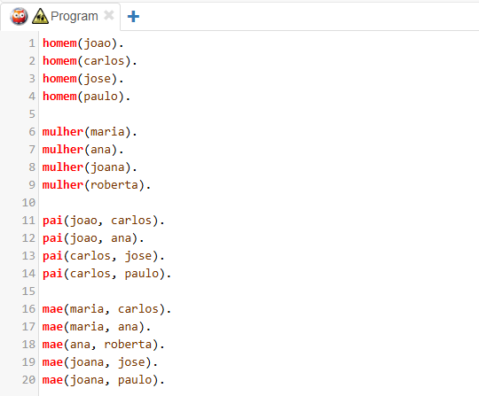
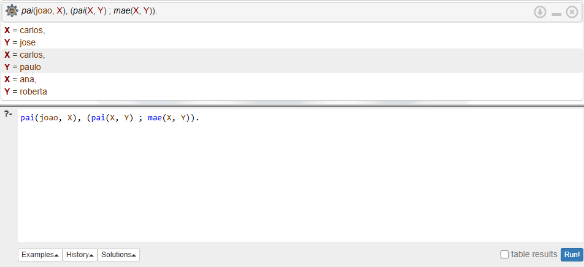
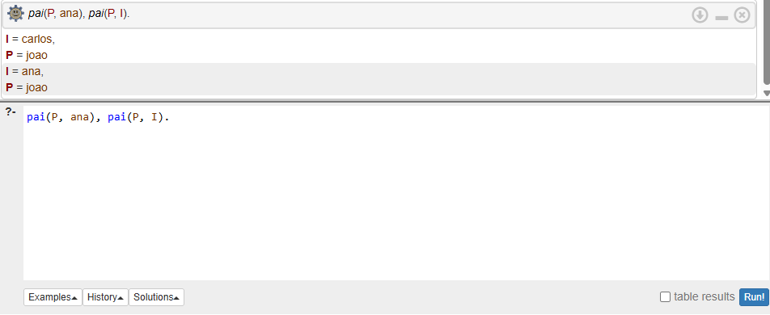
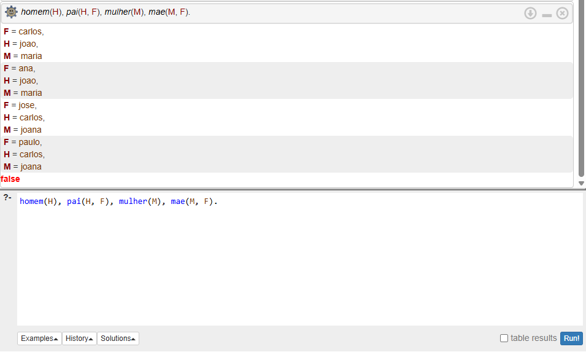

# Prolog
Atividade 6 - Roteiro guiado de programação

## 1. Introdução
O objetivo desta prática foi compreender os conceitos básicos da linguagem Prolog utilizando o ambiente SWISH Prolog. Durante a atividade foram trabalhados fatos, variáveis lógicas, consultas simples e compostas, além do uso dos operadores lógicos E (conjunção) e OU (disjunção) no motor de inferência.

## Codigo

## Desafio 1
Encontre um filho ou filha do João, e depois encontre os filhos dessa pessoa (ou seja, os netos do João).  
Minha Query Vencedora: ?- pai(joao, X), (pai(X, Y) ; mae(X, Y)).

## Desafio 2
Encontre uma pessoa P que seja pai da Ana, e depois encontre uma pessoa I (Irmão) que também seja filho desse mesmo pai P. 
Minha Query Vencedora: ?- pai(P, ana), pai(P, I).

## Desafio 3
Encontre um Homem H que seja pai de um filho F, E encontre uma Mulher M que seja mãe desse mesmo filho F. 
Minha Query Vencedora: ?- homem(H), pai(H, F), mulher(M), mae(M, F).

